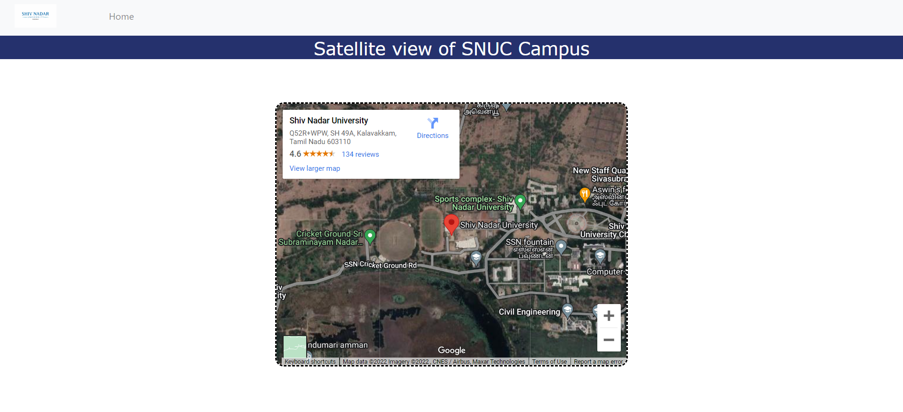

# SNUCTour 3D Web Application

# Description
This project not only aims to provide a comprehensive virtual tour but also to create an engaging and memorable experience for all users. Our virtual tour leverages cutting-edge 3D technology to recreate the university's stunning architecture and lush landscapes in high resolution. Users can navigate through various campus locations, including academic buildings, research labs, libraries, dormitories, sports facilities, and more. Each area is meticulously detailed to provide a realistic and engaging experience.
# Built with
The system uses the following major frameworks/ libraries:
<ul dir="auto">
 <li>
  
 </li>
  <li>
   
  </li>
 <li>
  
 </li>
 <li>
  
 </li>
 </ul>
 
## 1) Created a main webpage for the site

## 2) Made a tour via panoraven to tour with the 3D images

## 3) There is a gallery view for looking at the scenic beauty of the campus

## 4) There is also a satellite view linked to the google maps in order to give directions to the campus or for people to see the satellite view of the campus

## Precautions

Please download all the image and css and html files in order to run the web application and put all the following in a single file
